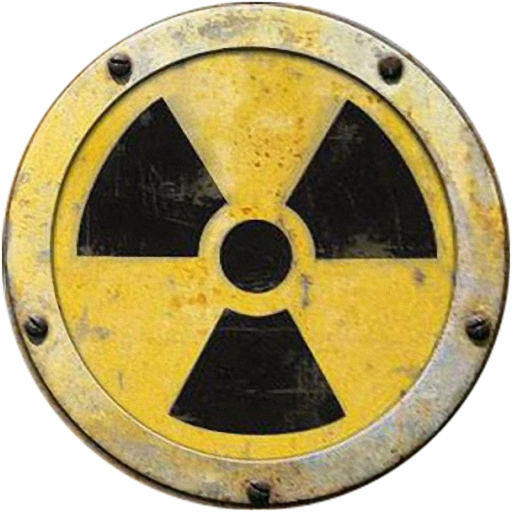

<h1 align="center">Hi, I'm Anastasiia👋</h1>

<h3 align="center">Mix of nuclear physics, electronics and programming </h3>

## 🛠️ Skills
&nbsp;
&nbsp;
&nbsp;
&nbsp;
&nbsp;
&nbsp;

## 📊 Statistics

## 🔉 Connect with me 

    
  
  

